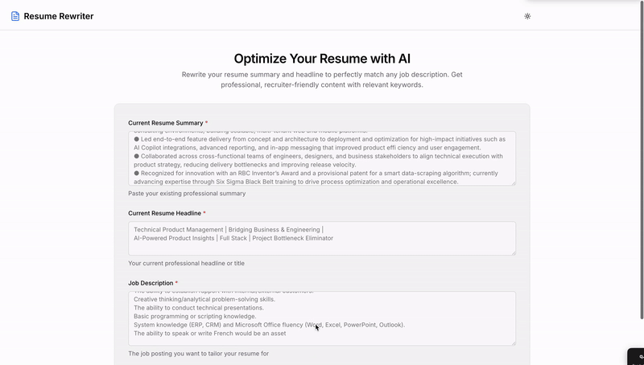

# AI-Powered Resume Rewriting Tool

# Demo

# Live Website

**[Try the Live App Here 🚀](https://resume-refiner.replit.app/)**

I recently built an **AI-powered tool** that rewrites **resume summaries and headlines** to perfectly match the **language, tone, and requirements** of the job you’re applying for — all in **less than an hour**.

This journey also highlights the distinction between **Generative AI (ChatGPT)** and **Agentic AI (Replit)**, and how they work together:

- **ChatGPT (Generative AI):** Helped me at every step — ideation, prompt design, tech stack planning, and generating AI logic.  
- **Replit (Agentic AI):** Took those ideas and **executed them autonomously**, generating the frontend, backend, API integration, and live deployment.

---

## Use Case & Problem Solving

**Pain Point:**  
Job seekers spend hours tailoring resume summaries and headlines to fit each job description, often resulting in generic content that doesn’t pass ATS or impress recruiters.

**Solution:**  
- The tool takes a **resume summary, headline, and job description** as input.  
- It uses **GPT-4 (ChatGPT)** to generate **tailored, recruiter-friendly outputs** instantly.  
- Users get **optimized summaries and headlines in seconds**, saving time and improving job application success.

---

## Development Workflow

1. **Ideation & Planning:** ChatGPT helped clarify the problem and define objectives.  
2. **Prompt Engineering & AI Logic:** Designed prompts for rewriting text to match tone, language, and job-specific keywords.  
3. **Tech Stack Planning:** ChatGPT suggested Replit + OpenAI for the fastest MVP.  
4. **Code Generation & Integration:** Replit generated the frontend, backend, and GPT API integration.  
5. **Deployment & Live Testing:** Replit hosted the tool, making it instantly accessible.

---

## Hiccups, Findings & Limitations

**Hiccups:**  
- I had to add **$\$ in my OpenAI and Replit accounts** — turns out these apps aren’t completely free.  
- Some errors were returned by OpenAI, which **Replit Agent helped fix after a few attempts**:  
  - Example: Server is now up after fixing the issue where **GPT-5 didn’t support strict JSON format mode**. I switched to **plain text with clear section markers** for parsing.  
  - Example 2: OpenAI sometimes sent **empty responses**.

**Findings:**  
- GPT responses can be **slow** at times.  
- Replit doesn’t automatically handle errors — I had to push it to proactively fix issues.

**Limitations:**  
- App runtime depends on **account credits**. Once OpenAI or Replit credits run out, the app stops working.

---

## Outcome

- The project demonstrates how **simple AI-built apps can solve big problems quickly**.  
- What might have taken an engineer a full day to code manually was accomplished by **Replit in less than an hour**, guided by ChatGPT.  
- Users now have a **live, AI-powered resume rewriting tool** that is fully functional and demonstrates the combined power of Generative and Agentic AI.
